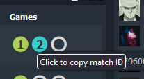
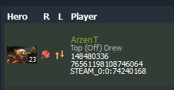
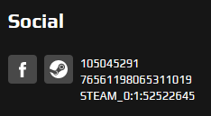
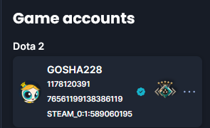
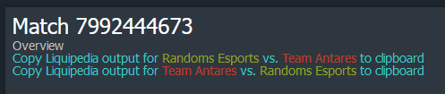
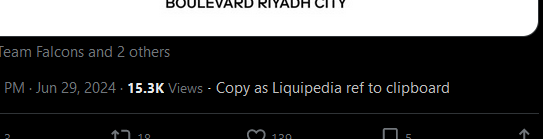

# Useful Greasemonkey scripts for Dota 2 Liquipedia editing
This repository contains various useful Greasemonkey scripts that I use to help my editing on Dota 2 Liquipedia.

## Install
These scripts are [Greasemonkey](https://addons.mozilla.org/en-GB/firefox/addon/greasemonkey/) scripts, that inject JavaScript into pages to run custom scripts.  This therefore requires Firefox and the Greasemonkey extension.

This may work with Google Chrome and Tampermonkey, but this is untested.

After installing Firefox and Greasemonkey, go to the Extensions menu (jigsaw icon) &gt; Greasemonkey &gt; New user script &gt; Copy-paste whichever script you want.  Make sure each script is in its own file.

## Scripts
### Copy match ID for live match on Dotabuff

At some point during 2024, Dotabuff stopped using its defunct TrackDota site.  However, this means that if you click the blue circle above, you no longer go to a page with a URL with the match ID.  This makes getting the match ID a pain.

This script changes this so that if you click the blue circle, it copies the match ID to the clipboard.  It changes the circle to a tick to confirm this occurred.

[Get this script](copy-id-for-live-dotabuff-match.js)

### Show player IDs on a match on Dotabuff

Sick of trying to figure out who is standing-in?  Or looking for smurfs?  This script displays the player IDs (ID32, ID64 and ID) beneath each player's name.  Also works for non-ticketed matches.

[Get this script](dotabuff-player-id-shower.js)

### Show player IDs on a player's profile on FACEIT

Since Dota players are inconvenient, and often choose completely different IDs for FACEIT, sometimes, we would like to easily see the Steam ID for a player on FACEIT.  This script adds the IDs (ID32, ID64 and ID) to the player's profile.

Except...  FACEIT's site is complete garbage, with obfuscated classes and dynamic HTML.  If you ever navigate to a player's profile (e.g. tournament &gt; bracket &gt; team &gt; player &gt; expand their profile), **you will need to refresh the page in order to view it.**

There is probably a way to do this automatically, but I couldn't figure it out.

[Get this script](faceit-player-id-shower.js)

### Show player IDs on a player's profile on ChallengerMode

This shows the player IDs on a player's profile page on ChallengerMode.

[Get this script](challengermode-player-id-shower.js)

### Export Dotabuff match to Liquipedia format

Sometimes, the Valve API goes down.  Dotabuff is more resilient for some reason.  This script will add links to the match screen to export the match to Liquipedia format to your clipboard.

Note the order should be what is on Liquipedia (e.g. in [FISSURE Universe Episode 2](https://liquipedia.net/dota2/FISSURE_Universe/2), the Grand Final is Entity (top) vs. OG (bottom), so select Entity vs. OG).

It also exports the map number (`|map1=`/`|map2=`/etc.); however, this is reliant on both teams selecting the same team consistently (this is not always the case).  As a result, be sure to check the map number before submitting changes.  You can also preview your edits and check the warning box at the top to see if there are any duplicate parameters - which indicate that a duplicate map number was used within a series.

[Get this script](export-dotabuff-to-liquipedia-format.js)

### Export tweet to Liquipedia ref

This script adds a link to export a tweet to a Liquipedia ref, copying it to the clipboard.

Note that this is not perfect.  You may need to strip off emojis and tweak some things.  You may need to add additional parameters like `accessdate` and `language`.  But it is a start.

[Get this script](export-tweet-to-liquipedia-ref.js)

## Contact
If you need to contact me, it is probably best if you leave me a message on my [Liquipedia Dota 2 talk page](https://liquipedia.net/dota2/User_talk:X42bn6).

You can also DM me on Discord (x42bn6), or email me at x42bn6 [at] gmail [dot] com.
